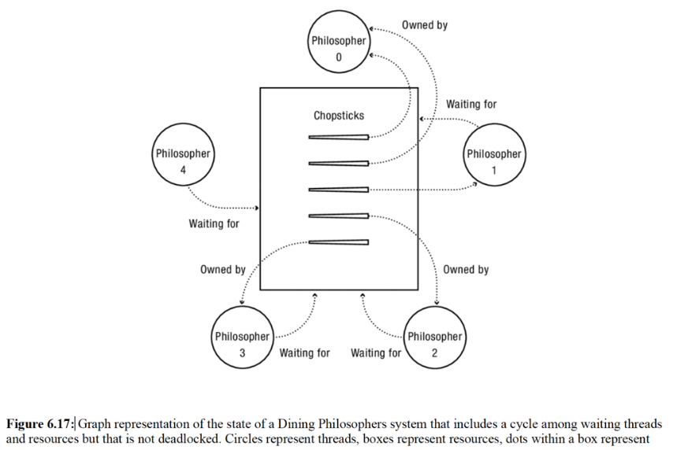

# CISS 370: Operating Systems

# Assignment 2

# Due: February 24, 2021

## Christian Elliott

### Question 1 (25 points)
#### Read Section 5.3.2 (Case study: Thread-Safe Bounded Queue).

```c
// Thread-safe queue interface
const int MAX = 10;
class TSQueue {
    // Synchronization variables
    Lock lock;
    // State variables
    int items[MAX];
    int front;
    int nextEmpty;

    public:
        TSQueue();
        ~TSQueue(){};
        bool tryInsert(int item);
        bool tryRemove(int *item);
};

// Initialize the queue to empty
// and the lock to free.
TSQueue::TSQueue() {
    front = nextEmpty = 0;
}

// Try to insert an item. If the queue is
// full, return false; otherwise return true.
bool TSQueue::tryInsert(int item) {
    bool success = false;
    lock.acquire();
    if ((nextEmpty - front) < MAX) {
        items[nextEmpty % MAX] = item;
        nextEmpty++;
        success = true;
    lock.release();
    return success;
}

// Try to remove an item. If the queue is
// empty, return false; otherwise return true.
bool TSQueue::tryRemove(int *item) {
    bool success = false;
    
    lock.acquire();
    if ((nextEmpty - front) < MAX) {
        items[nextEmpty % MAX] = item;
        nextEmpty++;
        success = true;
    }
    lock.release();
    return success;
}
```

Figure 5.3: A thread-safe bounded queue. For implementation simplicity, we
assume the queue stores integers (rather than arbitrary objects) and the total
number of items stored is modest. 

```c
// TSQueueMain.cc
// Test code for TSQueue.
int main() {
    TSQueue *queues[3];
    sthread_t workers[3];
    int i, j;
    // Start worker threads to insert.
    for (i = 0; i < 3; i++) {
        queues[i] = new TSQueue();
        thread_create_p(&workers[i], putSome, queues[i]);
    }
    
    // Wait for some items to be put.
    thread_join(workers[0]);
    
    // Remove 20 items from each queue.
    for (i = 0; i < 3; i++) {
        printf("Queue %d:\n", i);
        testRemoval(&queues[i]);
    }
}

// Insert 50 items into a queue.
void *putSome(void *p) {
    TSqueue *queue = (TSQueue *)p;
    int i;
    for (i = 0; i < 50; i++) {
        queue->tryInsert(i);
    }
    return NULL;
}

// Remove 20 items from a queue.
void testRemoval(TSQueue *queue) {
    int i, item;
    for (i = 0; i < 20; i++) {
        if (queue->tryRemove(&item))
            printf("Removed %d\n", item);
        else
            printf("Nothing there.\n");
    }
}
```
Figure 5.5: This code creates three TSQueue objects and then adds and removes 
some items from these queues. We use thread\_create\_p instead of thread\_create
so that we can pass to the newly created thread a pointer to the queue it should 
use. 

**Precisely describe the set of possible outputs that could occur when the 
program shown in Figure 5.5 is run.**

- In `main()`, we create 3 threads to work on 3 queues. Each attempts to execute 
`putSome()`, which will _try_ to place 50 items into the queue. However, the 
class method `tryInsert()` will only succeed if there are less than `MAX = 10` 
values in the queue. Further, `thread_join(workers[0])` only waits for 
`workers[0]` to execute `putSome()`. The main thread continues execution 
whether or not `workers[1]` and `workers[2]` have finished `putSome()`. Finally, 
the main thread runs `testRemoval()` on each worker, attempting to run 
`tryRemove()` 20 times. We can be sure `workers[0]` will complete execution 
fully. It should succeed in doing `tryRemove()` 20 times, 10 of which will pop 
items from the queue, with the other 10 printing that the queue is empty. 
We cannot predict the behavior of the other queues, since we can't be sure 
what execution point they'll be at by the time `main()` finishes. 

### Question 2 (25 points)
**Suppose that you mistakenly create an automatic (local) variable `v` in one 
thread `t1` and pass a pointer to `v` to another thread `t2`. Is it possible 
that a write by `t1` to some variable other than `v` will change the state of 
`v` as observed by `t2`? If so, explain how this can happen and give an 
example. If not, explain why not.**

- I tried to read up on the keyword `auto`, and I _think_ I'm correct in saying 
it essentially waits to determine the type until the expression's type is 
evaluated. I'm a little confused still, but I'll give it my best shot. 

    I don't believe it is possible. Auto probably creates a placeholder variable 
    in the heap to wait until a value can tell it the type. We know that 
    threads share heap data, so that is of concern. However, the question asks 
    about `t1` changing a variable other than `v`. Unless the write to the 
    other variable actually infringes on the heapspace allocated for `v`, 
    which I don't think it should do, `v` should not be impacted. 
    
### Question 3 (25 points)
**Suppose that you mistakenly create an automatic (local) variable `v` in one 
thread `t1` and pass a pointer to `v` to another thread `t2`. Is it possible 
that a write by `t2` to `v` will cause `t1` to execute the wrong code? If so, 
explain how. If not, explain why not.**

- To restate some of my answer to Q2: threads share heapspace. Auto almost 
certainly uses the heap, as it essentially creates a box (with probably enough 
space to fill any primitive type) that waits for the variable's type. This 
means that `v` is accessible by both threads. If `t1`'s execution depends on 
the value of `v` at some point, and `t2` has unwittingly written a value to `v` 
that causes the wrong execution of `t1`, the above scenario seems plausible. 

### Question 4 (25 points)


**Consider the variation of the Dining Philosophers problem shown in 
Figure 6.17, where all unused chopsticks are placed in the center of 
the table and any philosopher can eat with any two chopsticks.**
**One way to prevent deadlock in this system is to provide sufficient 
resources. For a system with n philosophers, what is the minimum 
number of chopsticks that ensures deadlock freedom? Why?**

* 2 * n. If there are enough chopsticks to ensure every philosopher 
will have two of his own, you don't need to worry about the issues 
that arise from sharing. 

